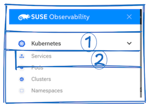
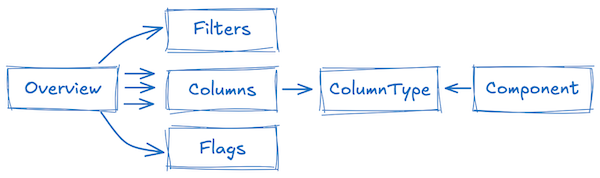
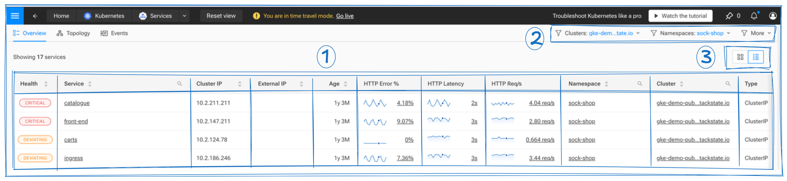
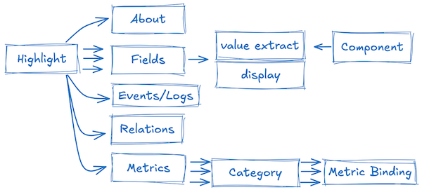
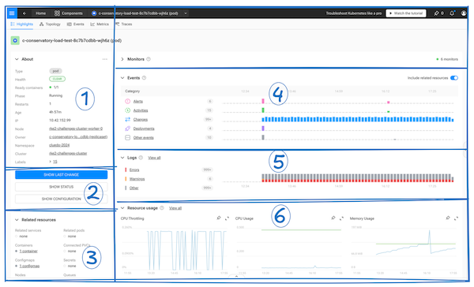

# SUSE Observability User Interface Extension

SUSE Observability provides an exceptional platform for monitoring and troubleshooting Kubernetes environments. At its core, 
it’s built on an extensible platform that leverages topology, time, telemetry, and traces. This flexibility means you can not only monitor
Kubernetes but also tailor the platform for other use cases by customizing monitors, remediation guides, ingestion pipelines, and user
interface elements.

In this guide, we’ll walk through how you can personalize some of the key user interface elements, including:

- **Menu**
- **Overview Page**
- **Highlight Page**

---

## Introduction

SUSE Observability uses a simple YAML syntax to define various configurations across the system. For example, a basic node configuration might look like this:

```yaml
nodes:
- _type: MainMenuGroup
  id: -100
  identifier: urn:stackpack:openlit:shared:main-menu-group:genai
  # ... additional configuration ...
```

Here’s what each key means:

- **_type**: Specifies the kind of node.
- **id**: A unique negative number that identifies the node within the configuration.
- **identifier**: A unique URN that identifies the node in SUSE Observability. For more details, see [Topology Identifiers](https://docs.stackstate.com/reference/identifiers#topology-identifiers).

---

## Menu Customization

The menu in SUSE Observability is organized hierarchically. A **MenuGroup** represents a collapsible section, and each **MenuItem** is a clickable link that takes you to a specific view defined by a QueryView.


### YAML Breakdown for the Menu

Below is a friendly explanation of the YAML structure behind the menu system.


  
#### 1. Main Menu Group

A Main Menu Group acts as a container for related menu items. Here’s an example:

```yaml
- _type: MainMenuGroup
  defaultOpen: false
  id: -100
  identifier: urn:stackpack:kubernetes-v2:shared:main-menu-group:kubernete
  name: Kubernetes
  items:
    - _type: MainMenuViewItem
      viewIdentifier: urn:stackpack:kubernetes-v2:shared:query-view:services
```

**Key parameters:**

- **_type**: Indicates the type (e.g., `MainMenuGroup`).
- **defaultOpen**: A boolean that decides if the group is expanded by default.
- **id**: A unique negative number for the group.
- **identifier**: The URN that uniquely represents this menu group.
- **name**: The name displayed in the menu.
- **items**: A list of menu items within the group.
  - **_type**: The type of the item (e.g., `MainMenuViewItem`).
  - **viewIdentifier**: Links the item to a specific QueryView.

#### 2. Query View

Query Views define what data is shown when you click a menu item. They control the overview page by setting up topology queries and visualization rules. If you don’t specify a view type, the default overview page is used.

Example:

```yaml
- _type: QueryView
  id: -101
  identifier: urn:stackpack:kubernetes-v2:shared:query-view:services
  name: Services
  description: Kubernetes Services.
  groupedByDomains: true
  groupedByLayers: false
  groupedByRelations: true
  showIndirectRelations: false
  groupingEnabled: true
  minimumGroupSize: 8
  query: (label IN ("stackpack:kubernetes") AND type IN ("service"))
  tags: []
  autoGrouping: true
  connectedComponents: true
  neighboringComponents: false
  viewType: urn:stackpack:k8s-common-v2:shared:view-type:service
  flags:
    - DisableEventHandlers
    - HideFromViewsOverview
```

**Key parameters:**

- **_type**: The type of item (here, `QueryView`).
- **id** and **identifier**: Unique values for the view.
- **name** and **description**: Text that describes the view.
- **query**: An [STQL](https://docs.stackstate.com/reference/k8sts-stql_reference) query that determines what data appears.
- **grouping options**: Flags like `groupedByDomains`, `groupingEnabled`, etc., help organize the data.
- **viewType**: Specifies the type of view for rendering.
- **flags**: Additional behavior modifiers (e.g., to disable event handlers or hide the view from overviews).


---

## Overview Page Customization

Overview pages in SUSE Observability are designed to present component data in tables. These tables are fully customizable with configurable columns, filters, and layout options.



A component in the system is represented in JSON, for example:

```json
{
    ...
    "name": "calico-typha-d9bc9565f-9xj5w",
    "labels": [{"name": "component-type:kubernetes-pod", "_type": "Label"}, ...],
    "state": {"healthState": "CLEAR", ... },
    "identifiers": ["urn:kubernetes:/rke2-challenges-cluster/pod/cb4b6"],
    "properties": {
        "clusterNameIdentifier": "urn:cluster:/kubernetes:rke2-challenges-cluster",
        "readyContainers": "1",
        "nodeName": "rke2-challenges-cluster-worker-1",
        // ... more properties ...
    }
    ...
}
```

### Key Concepts

- **Filters**: These allow you to restrict the displayed components based on label values. For example, you might filter components by namespace or cluster.
  
- **Flags**: Flags modify enabling card view and topology filtering.
  
- **Column Types**: Columns bind component data to visual elements in the table. Depending on the type, this binding can be automatic or require a specific path to a property.

Below is a overview of the available column types and their purposes.

---

### Column Types

| Name                        | Type                                  | Description                                                                                                  |
|-----------------------------|---------------------------------------|--------------------------------------------------------------------------------------------------------------|
| **Health Indicator**        | `ViewTypeTableColHealth`              | Shows a visual indicator of the component’s health without extra settings.                                  |
| **Component Name**          | `ViewTypeTableColName`                | Displays the component’s name, typically as the primary identifier.                                          |
| **Text Column**             | `ViewTypeTableColText`                | Displays text data from a specific component property.                                                       |
| **Numeric Column**          | `ViewTypeTableColNumber`              | Shows numeric data, with the option to include unit formatting (like GB or %).                                |
| **Duration Column**         | `ViewTypeTableColDuration`            | Displays time durations or ranges, such as the age of a component.                                             |
| **Component Link**          | `ViewTypeTableColComponentLink`       | Creates a clickable link to another related component (for example, linking a PVC to its PV).                  |
| **Readiness Status**        | `ViewTypeTableColReadyStatus`         | Indicates the readiness status of instances (like Kubernetes pods).                                           |
| **Prometheus Query**        | `ViewTypeTableColPromql`              | Retrieves and displays metrics calculated via a Prometheus query.                                             |
| **Metric Binding**          | `ViewTypeTableColMetricBinding`       | Connects a pre-defined metric (like CPU usage) to the table column.                                             |
| **Container Image Link**    | `ViewTypeTableColContainerImageLink`  | Provides a hyperlink to container images.                                                                    |
| **Ratio Column**            | `ViewTypeTableColRatio`               | Displays a ratio between two values (for instance, completed jobs versus total jobs).                          |

### YAML Breakdown for the Overview Page

Below is an explanation of the YAML structure behind the overview page.



#### 1. Defining Columns

Columns are set up in the `overview.columns` list. For example:

```yaml
- name: K8s pvc view definition
  overview:
    columns:
      - _type: ViewTypeTableColHealth
      - title: PersistentVolumeClaim
        _type: ViewTypeTableColName
      - title: PersistentVolume
        labelPrefix: persistent-volume
        pathToIdentifier: [properties, volumeNameIdentifier]
        width: 200
        _type: ViewTypeTableColComponentLink
      # ... additional columns ...
  identifier: urn:stackpack:k8s-common-v2:shared:view-type:persistent-volume-claim
  # ... other configuration ...
```

Below are some examples of individual column types:

#### 1.1 Health Indicator Column

Displays a simple health status indicator.

```yaml
- _type: ViewTypeTableColHealth
```

#### 1.2 Component Name Column

Displays the component’s name.

```yaml
- title: PersistentVolumeClaim
  _type: ViewTypeTableColName
```

#### 1.3 Text Column

Binds textual data from a specific property.

```yaml
- title: Access modes
  path: [properties, accessModes]
  width: 130
  _type: ViewTypeTableColText
```

#### 1.4 Numeric Column

Displays numeric values, with optional units.

```yaml
- title: Capacity
  path: [properties, storageCapacity]
  width: 100
  unit: gbytes
  _type: ViewTypeTableColNumber
```

#### 1.5 Duration Column

Shows a duration based on timestamps.

```yaml
- title: Age
  path: [properties, creationTimestamp]
  _type: ViewTypeTableColDuration
```

#### 1.6 Component Link Column

Creates a hyperlink to a related component.

```yaml
- title: PersistentVolume
  labelPrefix: persistent-volume
  pathToIdentifier: [properties, volumeNameIdentifier]
  width: 200
  _type: ViewTypeTableColComponentLink
```

#### 1.7 Readiness Status Column

Displays the readiness status of instances.

```yaml
- title: Ready pods
  readyPath: [properties, numberAvailable]
  totalPath: [properties, desiredNumberScheduled]
  statusPath: [properties, podsStatus]
  _type: ViewTypeTableColReadyStatus
```

#### 1.8 Prometheus Query Column

Uses a Prometheus query to display computed metrics.

```yaml
- title: CPU Requested %
  query: round(sum(...) / sum(...), 0.001)
  componentIdentifierTemplate: urn:kubernetes:/${cluster_name}:${namespace}:deployment/${deployment}
  unit: percentunit
  width: 140
  _type: ViewTypeTableColPromql
```

#### 1.9 Metric Binding Column

Binds a pre-defined metric to the column.

```yaml
- title: CPU Usage
  metricBindingIdentifier: urn:stackpack:kubernetes-v2:shared:metric-binding:pod-cpu-usage
  width: 160
  onlyTrendLine: false
  _type: ViewTypeTableColMetricBinding
```

#### 1.10 Container Image Link Column

Provides links to container images.

```yaml
- title: Image URL
  imageIdPath:
    - properties
    - imageID
  imagePath:
    - properties
    - image
  width: 200
  _type: ViewTypeTableColContainerImageLink
```

#### 1.11 Ratio Column

Shows the ratio between two values.

```yaml
- title: Completions
  numeratorPath:
    - properties
    - succeeded
  denominatorPath:
    - properties
    - completions
  _type: ViewTypeTableColRatio
```

#### 2. Adding Filters

Filters help narrow down the components shown in the view. For example, a label-prefixed filter might look like this:

```yaml
- name: K8s pvc view definition
  filters:
    - prefix: cluster-name
      name: cluster-name
      _type: LabelPrefixedFilter
  identifier: urn:stackpack:k8s-common-v2:shared:view-type:persistent-volume-claim
  # ... additional configuration ...
```

Topology and Event perspective filters are actived like this:


```yaml
- name: K8s pvc view definition
  filters:
    - tabs: ["EVENTS", "TRACE", "TOPOLOGY"]
      _type: TopologyFilters
  # ... additional configuration ...
```


#### 3. Setting Flags

Flags modify layout options. Two common flags are:

- **NoTopologyFilters**: Disables filtering based on topology.
- **CardsLayout**: Switches the view to a card-based layout (often used in NeuVector views).

```yaml
- name: K8s pvc view definition
  flags:
    - NoTopologyFilters
    - CardsLayout
  identifier: urn:stackpack:k8s-common-v2:shared:view-type:persistent-volume-claim
  # ... additional configuration ...
```

</details>

---

## Highlight Page Customization

Highlight pages in SUSE Observability are designed to break down complex data into meaningful insights for well-structured observability of a component.





### Understanding Key Components  

At the core of everything are **Fields**. These pull essential values from a component, structure them with display options, and present them as clear, readable information in the **About** section.  

On the **Highlight Page**, event and log widgets are managed through **Events/Logs** settings. Events and logs provide historical context, making it easier to track changes, debug issues, audit activity, and recognize patterns over time.  

**Relations** connect related resources, giving insight into dependencies and interactions. This web of connections helps users navigate complex infrastructures with ease.  

For performance monitoring, we rely on **Metrics**, which are organized into **Categories** and further refined by **Metric Bindings**. These ensure key system health indicators—like resource usage and latency—are well-structured and easy to analyze.  


### YAML Breakdown for the Highlight Page

Below in the sections that follow we explore the YAML structure behind the highlight page.


```yaml

- name: pod
  highlights:
    namePlural: pods
    fields:
      - fieldId: health
        label:
          title: Health
        valueExtractor:
          _type: HealthSource
        display:
          _type: HealthBadgeDisplay
        _type: ComponentTypeField
      # ... Other fields ommited
    about:
      fields:
        - type
        - health
        # ... Other fields ommited
      _type: ComponentTypeAbout
    events:
      showEvents: true
      relatedResourcesTemplate: (withNeighborsOf(direction = "both", components = ({COMPONENT_PREDICATE}), levels = "2") AND type IN ("deployment", "statefulset", "daemonset", "secret", "configmap")) OR ({COMPONENT_PREDICATE})
      _type: ComponentTypeEvents
    showLogs: true
    showLastChange: true
    externalComponent:
      showConfiguration: true
      showStatus: true
      externalIdSelector: '^urn:kubernetes:'
      _type: ComponentTypeExternalComponent
    relatedResources:
      - resourceType: service
        title: Related services
        stql: (withNeighborsOf(direction = "both", components = (id = "{COMPONENT_ID}"), levels = "1")) and type = "service"
        viewTypeIdentifier: urn:stackpack:k8s-common-v2:shared:view-type:service
        _type: ComponentTypeRelatedResources
      # ... Other fields ommited
    metrics:
      - name: Resource usage
        description: CPU and memory usage
        bindings:
          - urn:stackpack:kubernetes-v2:shared:metric-binding:pod-cpu-usage
          - urn:stackpack:kubernetes-v2:shared:metric-binding:pod-cpu-throttling
          - urn:stackpack:kubernetes-v2:shared:metric-binding:pod-memory-usage
        defaultExpanded: true
        _type: ComponentTypeMetricCategory
    _type: ComponentTypeHighlights
```



The break down of the screen roughly matches the elements in the `highlights` property in the YAML definition

| Section  | YAML Property                                                           
| -------- | --------------------------------- |
| `1`      | fields, about                     |
| `2`      | showLastChange, externalComponent |
| `3`      | relatedResources                  |
| `4`      | events                            |
| `5`      | showLogs                          |
| `6`      | metrics                           |

### Fields

Fields define individual data points displayed in the about view.
Each field includes:

#### **Field Parameters**
```yaml
- fieldId: <unique-id>                 # Identifier (e.g., "health", "age")
  label:
    title: <display-name>              # Human-readable label (e.g., "Health")
    helpBubbleText: <optional-help>    # Tooltip text (e.g., "Creation time relative to the view")
  valueExtractor:                      # Data source configuration
    _type: <source-type>               # e.g., PropertySource, CompositeSource, TagsSource
    key: <property-name>               # Property to extract (for PropertySource)
    sources:                           # Used in CompositeSource
      <sub-source-definitions>
  display:                             # Rendering configuration
    _type: <display-type>              # e.g., TagDisplay, HealthBadgeDisplay, DurationDisplay
    singular: <singular-form>          # For pluralizable displays (e.g., "label" → "labels")
  _type: ComponentTypeField            # Fixed type identifier
```
#### Component Data

Field extract data from the component JSON, for example:

```json
{
    ...
	"name": "calico-typha-d9bc9565f-9xj5w",
	"labels": [{"name": "component-type:kubernetes-pod", "_type": "Label"}, ..]
	"state": {"healthState": "CLEAR", .. },
	"synced": [
		{
		    ...
			"extTopologyElement": {
			    ...
				"data": { .. },
				"externalId": "urn:kubernetes:/rke2-challenges-cluster:calico-system:pod/calico-typha-d9bc9565f-9xj5w",
				"sourceProperties": { .. },
			},
		}
	],
	"identifiers": ["urn:kubernetes:/rke2-challenges-cluster/pod/cb4b6db9-f12f-43d6-b142-1af99bb96409"],
	"properties": {
		"clusterNameIdentifier": "urn:cluster:/kubernetes:rke2-challenges-cluster",
		"readyContainers": "1",
		"nodeName": "rke2-challenges-cluster-worker-1",
		"namespaceIdentifier": "urn:kubernetes:/rke2-challenges-cluster:namespace/calico-system",
		...
	},
}
```

#### **Value Sources**
The `valueExtractor` field defines how data is sourced for the field. The following source types are supported:

| Source Type                  | Description                                                              |
| ---------------------------- | ------------------------------------------------------------------------ |
| `PropertySource`             | Directly maps to a property (e.g., `creationTimestamp`).                 |
| `CompositeSource`            | Combines multiple sources into a single value.                           |
| `TagsSource`                 | Extracts tags/labels from the component.                                 |
| `HealthSource`               | Dynamic health status (requires integration with a health-check system). |
| `NameSource`                 | Extracts the component's name.                                           |
| `ComponentTypeSource`        | Extracts the component's type.                                           |
| `TagSource`                  | Extracts a specific tag by name.                                         |
| `LastUpdatedTimestampSource` | Extracts the last updated timestamp of the component.                    |
| `IdentifiersSource`          | Extracts identifiers associated with the component.                      |
| `ConstantSource`             | Uses a constant value.                                                   |

#### **Display Options**
The `display` field defines how the data is rendered. The following display types are supported:

| Display Type                     | Behavior                                      | Example Use Case          |
|----------------------------------|-----------------------------------------------|---------------------------|
| `TextDisplay`                    | Renders the value as plain text.             | Simple text fields         |
| `TagDisplay`                     | Renders values as tags.                       | Labels, identifiers       |
| `HealthBadgeDisplay`             | Shows health status with color-coded badges.  | Component health           |
| `HealthCircleDisplay`            | Shows health status with a circular indicator.| Component health           |
| `ViewTimeLink`                   | Renders a link to a specific view or time.    | Time-based navigation      |
| `DurationDisplay`                | Converts timestamps to relative durations.    | Age, last run time         |
| `ReadyStatusDisplay`             | Displays readiness status (e.g., ready/total).| Replica status             |
| `ComponentLinkDisplay`           | Renders as a clickable link to another component. | Cluster, namespace links |
| `RatioDisplay`                   | Displays a ratio (e.g., completions/succeeded).| Job completions            |
| `PromqlDisplay`                  | Renders Prometheus query results.             | Custom metric displays     |


#### **Example Field Configurations**

##### Example 1: Health Field
```yaml
- fieldId: health
  label:
    title: Health
  valueExtractor:
    _type: HealthSource
  display:
    _type: HealthBadgeDisplay
  _type: ComponentTypeField
```

##### Example 2: Composite Field (Cluster Name + Identifier)
```yaml
- fieldId: cluster
  label:
    title: Cluster
  valueExtractor:
    _type: CompositeSource
    sources:
      identifier:
        _type: PropertySource
        key: clusterNameIdentifier
      name:
        _type: TagSource
        tagName: cluster-name
  display:
    _type: ComponentLinkDisplay
  _type: ComponentTypeField
```

##### Example 3: Constant Field
```yaml
- fieldId: staticValue
  label:
    title: Static Value
  valueExtractor:
    _type: ConstantSource
    value: "This is a constant value"
  display:
    _type: TextDisplay
  _type: ComponentTypeField
```

##### Example 4: Tags Field
```yaml
- fieldId: labels
  label:
    title: Labels
  valueExtractor:
    _type: TagsSource
  display:
    _type: TagDisplay
    singular: label
  _type: ComponentTypeField
```

---

## Learn by Example

One of the best ways to learn is by seeing real examples in action. In this case, we’ll explore how SUSE Observability’s Kubernetes stackpack is implemented. The API endpoint `/api/node/<node type>` allows you to retrieve different types of nodes stored within SUSE Observability. To securely access these endpoints, you’ll need an API token, which you can copy from the CLI page in the SUSE Observability UI.

For clarity, all the examples below use the Linux `yq`, `jq` utilities. These tool converts JSON output into a more readable YAML format.


#### Main Menu

To fetch data for the **MainMenuGroup**, you first need to set your environment variables, and then execute the API call:

```bash
export URL=https://yourinstance
export API_TOKEN=xxxx

curl --location --request GET "$URL/api/node/MainMenuGroup?fullNode=true&timeoutSeconds=15" \
     --header "X-API-Token: $API_TOKEN" | yq -P
```

This command sends a GET request to the API, asking for the full details of the node, and then pipes the JSON response into `yq` for pretty-printing in YAML.


#### Menu Item

If you want to retrieve information for a **QueryView**, use this command:

```bash
curl --location --request GET "$URL/api/node/QueryView?fullNode=true&timeoutSeconds=15" \
     --header "X-API-Token: $API_TOKEN" | yq -P
```


#### Overview Page

To pull details about the **ViewType**, use this command:

```bash
curl --location --request GET "$URL/api/node/ViewType?fullNode=true&timeoutSeconds=15" \
     --header "X-API-Token: $API_TOKEN" | yq -P
```

#### Highlight Page

To pull only highlight details for **ComponentType**, use this command:

```bash
curl --location --request GET "$URL/api/node/ComponentType?fullNode=true&timeoutSeconds=15" \
     --header "X-API-Token: $API_TOKEN" \
     | jq 'map(select(.highlights != null) | {name, highlights})' | yq -Pyq -P
```


---

## Conclusion

This guide has provided a walkthrough of how to customize various aspects of SUSE Observability, from menus to overview pages. By adjusting the YAML configurations, you can tailor the platform to perfectly fit your monitoring needs.

Happy customizing!