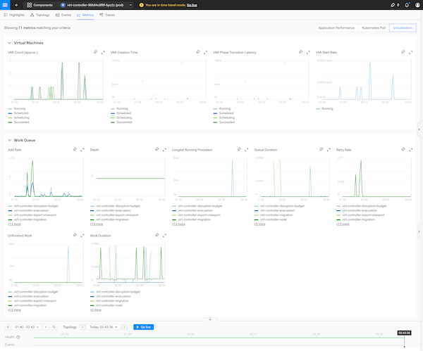

# Monitoring Your SUSE Virtualization Environment

In today’s dynamic IT landscapes, gaining deep visibility into your virtualization infrastructure is key to ensuring optimal performance and
rapid troubleshooting. In this guide, we’ll walk you through how to set up comprehensive monitoring for your SUSE Virtualization environment—from
installing the SUSE Observability Agent to creating custom dashboards and scraping specialized KubeVirt metrics.

---

## Why Monitor SUSE Virtualization?

Monitoring your SUSE Virtualization cluster allows you to:
- **Gain visibility:** Track the performance of your virtual machines (VMs) and underlying Kubernetes infrastructure.
- **Troubleshoot quickly:** Identify issues before they impact production.
- **Customize insights:** Create tailored views and dashboards focusing on the metrics that matter most to your operations.

While you can monitor your cluster using the SUSE Observability Agent as you would with any standard Kubernetes setup, integrating additional [KubeVirt metrics](https://kubevirt.io/user-guide/user_workloads/component_monitoring/#metrics-about-virtual-machines) offers deeper insights into your virtualization environment.

---

## Prerequisites

Before you start, ensure you have the following in place:
- **SUSE Observability Instance:** A running instance to collect and display your metrics.
- **SUSE Virtualization Cluster:** Your virtualization environment must be up and running.
- **Environment Configuration:** Make sure your `.env` file is correctly configured (refer to the main [README](../../../../README.md) for setup details).

### Quick Connectivity Check

Confirm that you can connect to your cluster by running:

```bash
cd suse/virtualization/vmi-metrics
eval $(task common:shell-env)
kubectl get nodes
```

---

## Step 1: Installing the SUSE Observability Agent

### Create a StackPack Instance

The first step involves setting up a Kubernetes StackPack instance. The instance name is determined by your `CLUSTER_NAME` environment variable. Simply run:

```bash
task install-stackpack-instance
```

### Deploy the Agent

Deploy the SUSE Observability Agent to start collecting metrics:

```bash
task common:deploy-observability-agent
```

After deployment, log in to your SUSE Observability instance. You should now see your cluster synced and begin receiving data.

---

## Step 2: Creating Custom Views for Virtual Machines

SUSE Observability provides the flexibility to create **custom views** so you can focus on key components of your virtualization environment. This is particularly useful for isolating data on virtual machines and their controllers.

### Define Custom Views

Using [STQL](https://docs.stackstate.com/reference/k8sts-stql_reference) queries, you can filter the data for different components:

- **VirtControllers:**  
  ```stql
  (label IN ("kubevirt.io:virt-control") AND type = "pod")
  ```
- **VirtualMachines:**  
  ```stql
  (label IN ("kubevirt.io:virt-launcher") AND type = "pod")
  ```

💡 **Pro Tip:** Star a view to pin it to the left menu for quick access.

For more details, check out the [custom view documentation](https://docs.stackstate.com/views/k8s-custom-views).

---

## Step 3: Scraping KubeVirt Metrics with OpenTelemetry

Your SUSE Virtualization environment exposes metrics through a Kubernetes service called `kubevirt-prometheus-metrics`. These metrics can be scraped and sent to SUSE Observability using the OpenTelemetry collector.

For a complete list of available metrics, refer to the [KubeVirt metrics documentation](https://kubevirt.io/monitoring/metrics.html#kubevirt).

### Sample OpenTelemetry Collector Configuration

Below is a sample configuration for the Prometheus receiver to scrape KubeVirt metrics:

```yaml
config:
  receivers:
    prometheus:
      config:
        scrape_configs:
        - job_name: 'kubevirt-metrics'
          scrape_interval: 30s
          tls_config:
            insecure_skip_verify: true
          scheme: https
          kubernetes_sd_configs:
            - role: endpoints
              selectors:
                - role: endpoints
                  field: "metadata.name=kubevirt-prometheus-metrics"
```

Deploy the preconfigured SUSE Observability OpenTelemetry collector with:

```bash
task deploy-kubevirt-otel-collector
```

Once deployed, navigate to the **Metrics** page in SUSE Observability. All collected KubeVirt metrics begin with the prefix **kubevirt_**.


---

## Step 4: Adding Custom Dashboard Charts

Visualizing your VM metrics is essential for effective monitoring. SUSE Observability allows you to create **custom charts** that can be adapted from pre-existing Grafana dashboards, such as the **Harvester Grafana Dashboard** and the **KubeVirt Monitoring Dashboard**.

### Sample Charts Overview

Below are examples of charts you might consider, grouped by their function:

#### Control Plane Charts

| **Name**                         | **PromQL Query**                                                                                                                                      |
| -------------------------------- | ----------------------------------------------------------------------------------------------------------------------------------------------------- |
| **VMI Creation Time**            | `histogram_quantile(0.95, sum(rate(kubevirt_vmi_phase_transition_time_from_creation_seconds_bucket{instance=~"$instance"}[5m])) by (phase, le))`     |
| **VMI Start Rate**               | `sum(rate(kubevirt_vmi_phase_transition_time_from_creation_seconds_count{phase="Running", instance=~"$instance"}[5m])) by (instance)`                   |
| **VMI Phase Transition Latency** | `histogram_quantile(0.95, sum(rate(kubevirt_vmi_phase_transition_time_seconds_bucket{phase="Failed", instance=~"$instance"}[5m])) by (le,phase))`        |
| **VMI Count (approx.)**          | `sum(increase(kubevirt_vmi_phase_transition_time_from_creation_seconds_count{phase="Running", instance=~"$instance"}[20m])) by (instance)`               |
| **Work Queue - Add Rate**        | `sum(rate(kubevirt_workqueue_adds_total{job=~".*kubevirt.*", instance=~"$instance"}[1m])) by (instance, name)`                                        |
| **Work Queue - Depth**           | `kubevirt_workqueue_depth{job=~".*kubevirt.*", instance=~"$instance"}`                                                                                 |
| **Work Queue - Queue Duration**  | `histogram_quantile(0.99, sum(rate(kubevirt_workqueue_queue_duration_seconds_bucket{job=~".*kubevirt.*", instance=~"$instance"}[1m])) by (instance, name, le))` |
| **Work Queue - Work Duration**   | `histogram_quantile(0.99, sum(rate(kubevirt_workqueue_work_duration_seconds_bucket{job=~".*kubevirt.*", instance=~"$instance"}[1m])) by (instance, name, le))`  |
| **Work Queue - Unfinished Work** | `kubevirt_workqueue_unfinished_work_seconds{job=~".*kubevirt.*", instance=~"$instance"}`                                                                 |
| **Work Queue - Retry Rate**      | `rate(kubevirt_workqueue_retries_total{instance=~"$instance"}[1m])`                                                                                     |
| **Work Queue - Longest Running Processor** | `kubevirt_workqueue_longest_running_processor_seconds{job=~".*kubevirt.*", instance=~"$instance"}`                                                     |

#### Virtual Machine Instance Charts

| **Name**                         | **PromQL Query**                                                                                                                                                 |
| -------------------------------- | ---------------------------------------------------------------------------------------------------------------------------------------------------------------- |
| **CPU Usage**                    | `topk(${count}, (avg(rate(kubevirt_vmi_vcpu_seconds[5m])) by (domain, name)))`                                                                                   |
| **Memory Usage**                 | `topk(${count}, ((kubevirt_vmi_memory_available_bytes - kubevirt_vmi_memory_unused_bytes) / kubevirt_vmi_memory_available_bytes))`                              |
| **Storage Read Traffic Bytes**   | `topk(${count}, (irate(kubevirt_vmi_storage_read_traffic_bytes_total[5m])))`                                                                                    |
| **Storage Write Traffic Bytes**  | `topk(${count}, (irate(kubevirt_vmi_storage_write_traffic_bytes_total[5m])))`                                                                                   |
| **Network Receive Bits**         | `topk(${count}, (irate(kubevirt_vmi_network_receive_bytes_total[5m])*8))`                                                                                        |
| **Network Transmit Bits**        | `topk(${count}, (irate(kubevirt_vmi_network_transmit_bytes_total[5m])*8))`                                                                                       |
| **Network Receive Packets (2h)** | `topk(${count}, (delta(kubevirt_vmi_network_receive_packets_total[2h])))`                                                                                        |
| **Network Transmit Packets (2h)**| `topk(${count}, (delta(kubevirt_vmi_network_transmit_packets_total[2h])))`                                                                                       |
| **IO Traffic**                   | `irate(kubevirt_vmi_storage_write_traffic_bytes_total{namespace="$namespace", name="$vm"}[5m])`                                                                    |
| **IO Time**                      | `irate(kubevirt_vmi_storage_write_times_ms_total{namespace="$namespace", name="$vm"}[5m])`                                                                          |
| **IOPS**                         | `irate(kubevirt_vmi_storage_iops_write_total{namespace="$namespace", name="$vm"}[5m])`                                                                             |

### Converting PromQL Queries for SUSE Observability

SUSE Observability uses **STQL queries** to bind metrics to specific topology components. The key is mapping metric tags to your component’s tags.

#### Example Conversion

Given the Grafana PromQL query:

```promql
kubevirt_workqueue_unfinished_work_seconds{job=~".*kubevirt.*", instance=~"$instance"}
```

The equivalent query for a SUSE Observability chart would be:

```promql
kubevirt_workqueue_unfinished_work_seconds{k8s_cluster_name="${tags.cluster-name}", k8s_pod_name="${name}"}
```

#### Completed Chart Definition

Here’s an example of a complete chart configuration:

```yaml
- id: -120
  name: Unfinished Work
  queries:
    - expression: kubevirt_workqueue_unfinished_work_seconds{k8s_cluster_name="${tags.cluster-name}", k8s_pod_name="${name}"}
      alias: '${name}'
  scope:  type in ("pod") and label = "kubevirt.io:virt-controller"
  identifier: urn:stackpack:kubevirt:shared:metric-binding:work-queue-unfinished-work
  unit: s
  chartType: line
  priority: high
  enabled: true
  layout:
    metricPerspective:
      tab: Virtualization
      section: Work Queue
    componentSummary:
      weight: 3
  _type: MetricBinding
```

### Applying Your Chart Definitions

Once you have defined your custom charts, apply them to your SUSE Observability instance with:

```bash
task upload-metric-bindings
```

Now, when you navigate to a `virt-controller` or `virt-launcher` pod's metrics page, you will see the new **Virtualization** tab showcasing your custom dashboards.




---

## Conclusion

By following these steps, you’ve set up an advanced monitoring environment for your SUSE Virtualization cluster. From deploying the SUSE Observability Agent and configuring custom views to scraping specialized KubeVirt metrics and creating tailored dashboards, you now have the tools to maintain peak performance and swiftly address issues within your virtual infrastructure.

Monitoring like this ensures that you capture all the critical details of your SUSE Virtualization environment, enabling you to keep a close eye on both your virtual machines and the underlying Kubernetes infrastructure. Happy monitoring! 🚀

---
